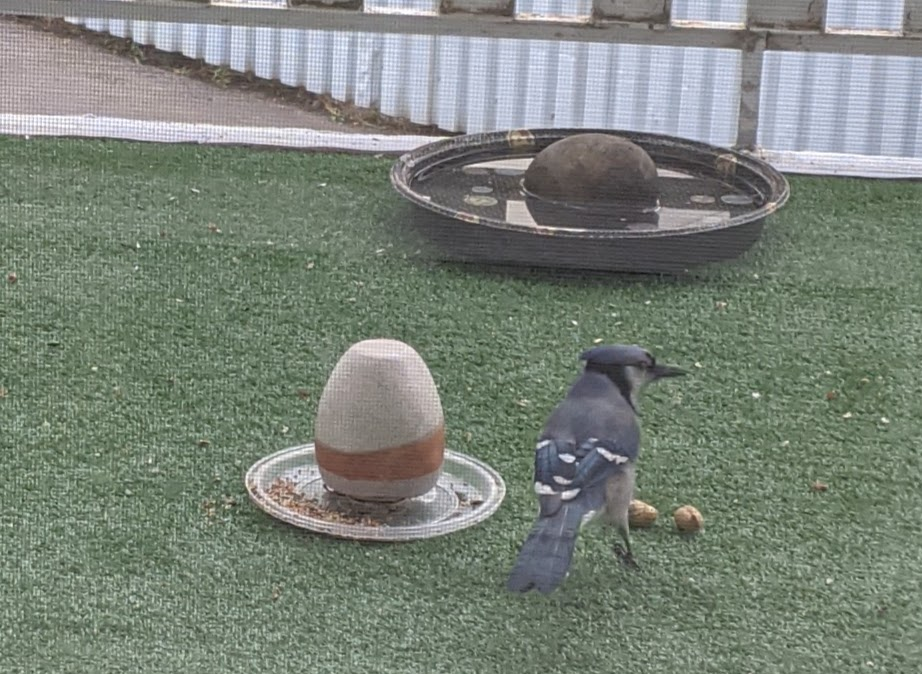

## A Beginner's Guide to Lighting Objects in Three.js
- ExchangeJS
- October 7, 2021
- Alexander Wong


### About Me (2021)
- Finished my MSc. from University of Alberta
    - Supervised by Dr. Abram Hindle
- Started as a Senior Software Developer at [Intuit](https://intuit.com)
    - Quickbooks, Full Stack Development
- Recently picked up `Balcony Bird Watching`


[](https://photos.app.goo.gl/b5QV1XhjvUMNFCyd8)


<!-- ThreeJS introduction, project setup -->
### ThreeJS Overview

- No prior ThreeJS knowledge needed for this talk
- Quick overview into setting up:
    1. New Scene
    2. Adding Geometries
    3. Adding Lighting
    4. Adding Debug GUI


All project setup is already done!

- [esbuild](https://esbuild.github.io/)
- [three](https://threejs.org/)
- [typescript](https://www.typescriptlang.org/)


Source code: https://github.com/awwong1/threejs-exchangejs-code
```bash
# git clone https://github.com/awwong1/threejs-exchangejs-code
git clone git@github.com:awwong1/threejs-exchangejs-code.git
cd threejs-exchangejs-codeta
git fetch --all --tags
git checkout tags/v0.1 -b v0.1-branch

# Begin
yarn && yarn start
```


<!-- New project, new Scene -->
### New Scene

If you're getting a blank screen, it's OK!


```html
<!doctype html>
<html lang="en">
<head>
  <meta charset="utf-8">
  <title>ThreeJS ExchangeJS Code</title>
  <meta name="viewport" content="width=device-width, initial-scale=1">
  <style>body { margin: 0; }</style>
</head>
<body>
    <canvas id="canvas"></canvas>
    <script src="js/app.js"></script>
</body>
</html>
```
Blank HTML page structure with Canvas DOM element in body.


```typescript
import * as THREE from 'three';

const handleOnWindowResize = (
  renderer: THREE.WebGLRenderer,
  camera: THREE.PerspectiveCamera,
  scene: THREE.Scene
) => (): void => {
  const aspectRatio = window.innerWidth / window.innerHeight
  camera.aspect = aspectRatio
  camera.updateProjectionMatrix()
  renderer.setSize(window.innerWidth, window.innerHeight)
  renderer.setPixelRatio(Math.min(window.devicePixelRatio, 2))
  renderer.render(scene, camera)
}
```
Callback function for handling window viewport resize.


```typescript
const main = () => {
  // Initialize DOM Canvas and viewport sizes
  const canvas = <HTMLCanvasElement | null>document.getElementById('canvas')
  if (canvas === null) return

  // ...
}
```
Fetch the DOM Canvas by element ID.


```typescript
  // Initialize Scene
  const scene = new THREE.Scene()

  // Initialize the Camera and add it to the scene
  const camera = new THREE.PerspectiveCamera(75, window.innerWidth / window.innerHeight, 0.1, 100)
  camera.position.set(1, 1, 2)
  scene.add(camera)
```
Initialize the scene, add a perspective camera to the scene.


```typescript
  // Initialize the Renderer
  const renderer = new THREE.WebGLRenderer({ canvas })
  renderer.setSize(window.innerWidth, window.innerHeight)
  renderer.setPixelRatio(Math.min(window.devicePixelRatio, 2))

  window.addEventListener('resize', handleOnWindowResize(renderer, camera, scene), false)
```
Initialize the renderer, add the resize handler callback function.


```typescript
  // Render loop
  const tick: FrameRequestCallback = (curTime) => {
    const elapsedTime = curTime / 1000
    renderer.render(scene, camera)

    // Call tick again on the next frame
    window.requestAnimationFrame(tick)
  }
  window.requestAnimationFrame(tick)
```
Render loop on animation frames.


```typescript
if (document.readyState === 'complete') {
  main()
} else {
  window.addEventListener('load', main)
}
```
Run the `main` function when the document is ready.


<!-- Adding geometries to the scene -->
### Adding Geometries

```typescript
  // Adding in a basic cube
  const geometry = new THREE.BoxGeometry(1, 1, 1)
  const material = new THREE.MeshBasicMaterial({ color: 0x663399 })
  const mesh = new THREE.Mesh(geometry, material)
  scene.add(mesh)
```
Between the camera and the renderer, add a purple cube to the scene.


```typescript
    // make cube rotate (Euler angles, radians) and set camera focus
    mesh.rotation.set(elapsedTime, elapsedTime, elapsedTime)
    camera.lookAt(mesh.position)
```
Within the render loop, spin the cube around and make the camera look at it.


Feel free to play with all of the different ThreeJS Geometries!

[https://threejs.org/docs/index.html?q=Geometry](https://threejs.org/docs/index.html?q=Geometry#api/en/core/BufferGeometry)


<!-- Orbit controls -->
### Orbit Controls

ThreeJS comes with many useful helper utilities for moving within the scene.
Let's add the orbit controls so we can pan, rotate, and zoom around our scene.

```typescript
import { OrbitControls } from 'three/examples/jsm/controls/OrbitControls'

// ... within main()
  const controls = new OrbitControls(camera, canvas)
  controls.enableDamping = true
```


<!-- Adding lights to the scene -->
### Adding Lights

The `MeshBasicMaterial` that we are currently using does not interact with lights.

```typescript
  const material = new THREE.MeshStandardMaterial({ color: 0x663399 })
```
Update the material from `MeshBasicMaterial` to `MeshStandardMaterial`.
The scene is completely dark now, so add in a directionless ambiant light.

```typescript
  // Adding in an ambient (directionless) light
  const ambientLight = new THREE.AmbientLight(0xffffff, 0.3)
  scene.add(ambientLight)
```


There are a variety of lights that you can use!

We will not cover them all. Only the following lights support shadows:

- [PointLight](https://threejs.org/docs/index.html#api/en/lights/PointLight)
- [DirectionalLight](https://threejs.org/docs/index.html#api/en/lights/DirectionalLight)
- [SpotLight](https://threejs.org/docs/index.html#api/en/lights/SpotLight)


Let's just play with the directional light today.

```typescript
  const directionalLight = new THREE.DirectionalLight(0xffffff, 0.6)
  scene.add(directionalLight)
  directionalLight.position.set(2, 2, -1)
```
Add a directional light to the scene.


<!-- Adding shadows to the scene -->
### Adding Shadows

What would happen if we placed a plane underneath our cube? Would the light cast a shadow on this plane?

```typescript
  // Add in a plane to receive a shadow from the cube
  const plane = new THREE.Mesh(new THREE.PlaneGeometry(5, 5), material)
  plane.rotation.x = - Math.PI * 0.5
  plane.position.y = - 0.95
  scene.add(plane)
```
We see the plane below our cube, but no shadow is being cast.


The renderer shadow map must be enabled, and the shadow receiving and casting properties must be set.

```typescript
  // Below renderer initialization
  renderer.shadowMap.enabled = true

  // Light and the cube should cast a shadow
  directionalLight.castShadow = true
  mesh.castShadow = true

  // Plane should receive the shadow
  plane.receiveShadow = true
```


Basic mesh and shadows are now being rendered! Great job!


Slightly more advanced demo

- [https://app.udia.ca/threejs/15](https://app.udia.ca/threejs/15)
- [https://git.sr.ht/~udia/app.udia.ca/tree/main/item/assets/src/threejs/threejs_15.ts](https://git.sr.ht/~udia/app.udia.ca/tree/main/item/assets/src/threejs/threejs_15.ts)

